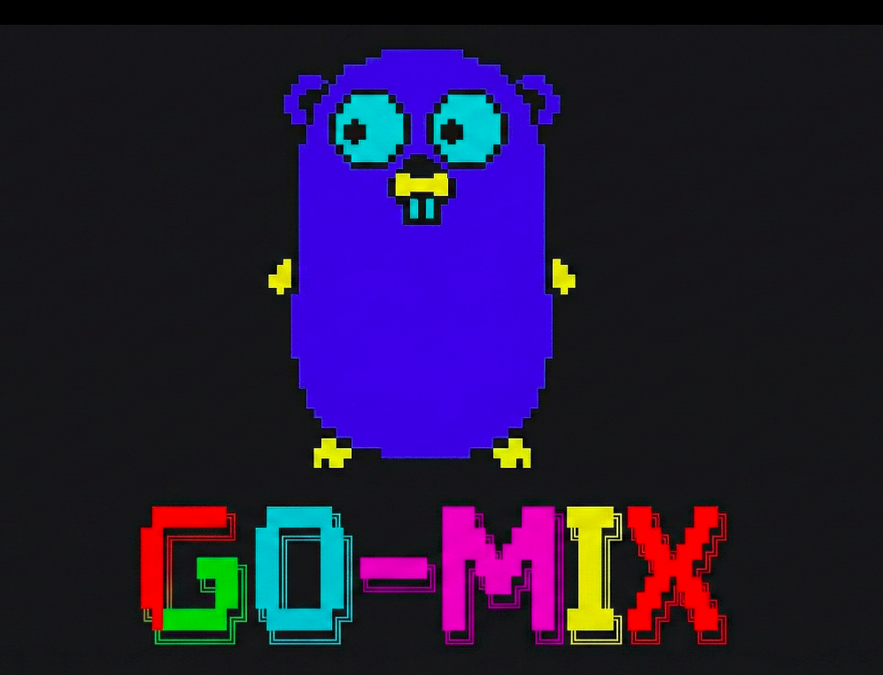

# 🚀 GoMix Programming Language



[](https://golang.org/)
[](https://opensource.org/licenses/MIT)
[](https://github.com/akashmaji946/go-mix)

**GoMix** is a high-performance, interpreted programming language implemented in Go. It combines dynamic typing with static safety features, lexical closures, and a comprehensive standard library—perfect for prototyping, education, and embedding as a scripting layer in Go applications.

---

## Table of Contents

- [Quick Start](#-quick-start)
- [Core Architecture](#-core-architecture)
- [Language Features](#-language-features)
- [Data Types](#data-types)
- [Variables & Scoping](#variables--scoping)
- [Control Flow](#control-flow--iteration)
- [Functions](#functions--higher-order-programming)
- [Object-Oriented Programming](#object-oriented-programming)
- [Standard Library](#-standard-library--builtins)
- [Error Handling](#error-handling)
- [Sample Programs](#-sample-programs)
- [Development](#development--contributing)

---

## 🚀 Quick Start

### Installation

**Prerequisites**: Go 1.18 or higher

**Clone & Build:**
```bash
git clone https://github.com/akashmaji946/go-mix.git
cd go-mix
./build.sh
```

This generates the `go-mix` executable in the current directory.

### Usage

**Interactive REPL (Read-Eval-Print Loop):**
```bash
./go-mix
```

This launches an interactive session where you can type GoMix code line-by-line:
```
Go-Mix >>> var x = 42
Go-Mix >>> println(x)
42
Go-Mix >>> 
```

**Run a Program File:**
```bash
./go-mix samples/algo/05_factorial.gm
./go-mix path/to/your/script.gm
```

**Run Tests:**
```bash
go test ./...           # All tests
go test ./lexer -v      # Verbose
go test -coverage       # With coverage report
```

---

## 📚 Core Architecture

### 1. **Pratt Parser (Top-Down Operator Precedence)**

GoMix uses a sophisticated Pratt Parser for expression parsing. Rather than relying on traditional recursive descent, the algorithm associates parsing logic directly with tokens and their precedence levels. This approach enables elegant handling of:

- **Complex operator hierarchies** — bitwise vs. arithmetic operators
- **Member access** — nested object property access (`obj.field.nested`)
- **Function calls** — argument parsing with proper precedence
- **Extensibility** — new operators can be added with minimal code changes

### 2. **Hybrid Type System**

GoMix implements three distinct variable kinds, each with different semantics:

```gomix
var x = 42;          // Dynamic: type can change at runtime
let y = 3.14;        // Static: type-locked after first assignment
const PI = 3.14159;  // Immutable: cannot be reassigned
```

**Dynamic Variables (`var`):**
- Type can change during execution
- Ideal for rapid prototyping and flexible code
- Behavior similar to Python or JavaScript

**Static Variables (`let`):**
- Type is locked on first assignment
- Provides safety without explicit type annotations
- Prevents accidental type changes

**Immutable Constants (`const`):**
- Cannot be reassigned after initial binding
- Useful for configuration values and constants
- Provides compile-time and runtime safety

### 3. **Lexical Scoping & Closures**

Functions are first-class citizens with full support for lexical closures:

```gomix
fn makeCounter(start) {
    var count = start;
    fn increment() { 
        count = count + 1; 
        return count; 
    }
    return increment;
}

var counter = makeCounter(0);
println(counter()); // 1
println(counter()); // 2
println(counter()); // 3

// Each counter maintains its own 'count' variable
var counter2 = makeCounter(100);
println(counter2()); // 101
```

Variables are captured by reference in closures, allowing stateful function objects.

---

## 🎯 Language Features

### Data Types

GoMix supports six primitive types plus `nil`:

| Type | Example | Size | Notes |
|:-----|:--------|:-----|:------|
| `int` | `42`, `0xFF`, `0o77` | 64-bit | Signed integers; hex (0x) and octal (0o) support |
| `float` | `3.14`, `1.2e3`, `1e-5` | 64-bit | IEEE-754 double precision |
| `bool` | `true`, `false` | 1-bit | Boolean logic values |
| `string` | `"Hello"`, `"Line1\nLine2"` | Variable | UTF-8 strings with escape sequences |
| `char` | `'A'`, `'\n'`, `'\t'` | 32-bit | Single Unicode character |
| `nil` | `nil` | Pointer-size | Represents absence of value |

**Type Conversion Examples:**
```gomix
var s = "42";
var n = tostring(123);      // "123"
var i = 42;
var f = 42.0;               // Auto-conversion in numeric context

// Type checking
typeof(42);                 // "int"
typeof(3.14);              // "float"
typeof("text");            // "string"
typeof(true);              // "bool"
typeof(nil);               // "nil"
```

### Variables & Scoping

#### Declaration & Assignment

```gomix
// Variable declaration
var x = 10;
var y = "hello";
var z;                     // Uninitialized (nil)

// Static variables (type-locked)
let count = 0;
count = count + 1;         // OK
count = "text";            // ERROR: type mismatch

// Constant values
const MAX_SIZE = 100;
const PI = 3.14159;
MAX_SIZE = 200;            // ERROR: constants are immutable

// Multiple declaration (comma-separated)
var a = 1, b = 2, c = 3;
```

#### Scoping Rules

GoMix implements lexical (static) scoping with proper block-level scope:

```gomix
var x = "global";

fn testScope() {
    var x = "function";     // Shadows outer x
    println(x);             // "function"
    
    if (true) {
        var x = "block";    // Shadows function-level x
        println(x);         // "block"
    }
    
    println(x);             // "function" (block x is gone)
}

println(x);                 // "global"
```

---

## Control Flow & Iteration

### Conditionals

#### If-Else Statements

```gomix
if (age >= 18) {
    println("Adult");
} else if (age >= 13) {
    println("Teenager");
} else {
    println("Child");
}

// Ternary operator (via if-else)
var status = if (x > 0) { "positive"; } else { "non-positive"; };
```

#### Boolean Logic (Short-Circuit Evaluation)

```gomix
var x = 5;

// AND operator (&&) - short circuits if first operand is false
if (x > 0 && x < 10) {
    println("Between 0 and 10");
}

// OR operator (||) - short circuits if first operand is true
if (x < 0 || x > 100) {
    println("Outside range");
}

// NOT operator (!)
if (!isError) {
    println("Success");
}

// Compound conditions
if ((x > 0 && x < 10) || (x > 100 && x < 110)) {
    println("Valid");
}
```

### Loops

#### C-Style For Loop

```gomix
// Standard for loop
for (var i = 0; i < 5; i = i + 1) {
    println(i);  // 0, 1, 2, 3, 4
}

// With break and continue
for (var i = 0; i < 10; i = i + 1) {
    if (i == 3) { continue; }    // Skip iteration
    if (i == 7) { break; }       // Exit loop
    println(i);
}

// Nested loops
for (var i = 0; i < 3; i = i + 1) {
    for (var j = 0; j < 3; j = j + 1) {
        println(i, j);
    }
}
```

#### While Loop

```gomix
var count = 0;
while (count < 5) {
    println(count);
    count = count + 1;
}

// Multiple conditions
var x = 10, y = 0;
while (x > 0, y < 10) {
    x = x - 1;
    y = y + 1;
}

// Infinite loop with break
var i = 0;
while (true) {
    if (i >= 100) { break; }
    i = i + 1;
}
```

#### Range Iteration (Foreach)

```gomix
// Range iteration (inclusive)
foreach i in 1...5 {      // 1, 2, 3, 4, 5
    println(i);
}

// Reverse range
foreach i in 5...1 {      // 5, 4, 3, 2, 1
    println(i);
}

// Array iteration with value
var arr = [10, 20, 30];
foreach val in arr {
    println(val);
}

// Array iteration with index and value
foreach idx, val in arr {
    println(idx, val);    // 0, 10; 1, 20; 2, 30
}
```

---

## Collections & Data Structures

### Arrays (Mutable Sequences)

```gomix
// Array literals
var empty = [];
var numbers = [1, 2, 3, 4, 5];
var mixed = [1, "hello", true, 3.14];
var nested = [[1, 2], [3, 4], [5, 6]];

// Array indexing (0-based)
var arr = [10, 20, 30, 40, 50];
println(arr[0]);           // 10 (first element)
println(arr[2]);           // 30 (third element)

// Negative indexing (Python-style)
println(arr[-1]);          // 50 (last element)
println(arr[-2]);          // 40 (second-to-last)

// Index assignment
arr[1] = 25;               // [10, 25, 30, 40, 50]
arr[-1] = 55;              // [10, 25, 30, 40, 55]

// Array length
println(length(arr));      // 5
println(size(arr));        // 5 (alias)

// Array methods
push(arr, 60);             // Add to end: [10, 25, 30, 40, 55, 60]
pop(arr);                  // Remove from end: [10, 25, 30, 40, 55]
unshift(arr, 5);           // Add to start: [5, 10, 25, 30, 40, 55]
shift(arr);                // Remove from start: [10, 25, 30, 40, 55]
```

### Maps (Dictionaries)

```gomix
// Map literals (string keys only)
var user = map{
    "name": "Alice",
    "age": 30,
    "city": "New York"
};

// Key access
println(user["name"]);     // "Alice"
println(user["age"]);      // 30

// Adding/updating keys
user["email"] = "alice@example.com";
user["age"] = 31;

// Checking keys (error if missing)
// Note: accessing non-existent key returns nil or error

// Map methods
println(length(user));     // Number of key-value pairs
```

### Lists (Heterogeneous)

```gomix
// Lists are explicitly mutable sequences
var list = list(1, "two", 3.0, true, nil);

// Access like arrays
println(list[0]);          // 1
println(list[1]);          // "two"

// Different from arrays in type flexibility
var mixed_array = [1, 2, 3];  // Homogeneous
var mixed_list = list(1, "2", 3.0);  // Heterogeneous
```

### Tuples (Immutable Sequences)

```gomix
// Tuples are fixed-size, immutable
var coords = tuple(10, 20);
var rgb = tuple(255, 128, 64);
var data = tuple("John", 25, true);

// Access like arrays
println(coords[0]);        // 10
println(coords[1]);        // 20

// Immutable - cannot be modified
coords[0] = 15;            // ERROR
```

### Sets (Unique Values)

```gomix
// Sets contain unique values
var primes = set{2, 3, 5, 7, 11};
var colors = set{"red", "green", "blue"};
var numbers = set{1, 2, 2, 3, 3, 3};  // Results in {1, 2, 3}

// Checking membership
// Note: Set operations depend on implementation

println(length(primes));   // 5
```

---

## Functions & Higher-Order Programming

### Function Definitions

```gomix
// Basic function
fn greet(name) {
    return "Hello, " + name;
}

println(greet("Alice"));   // "Hello, Alice"

// Function with multiple parameters
fn add(a, b) {
    return a + b;
}

println(add(3, 5));        // 8

// Function with no return (returns nil)
fn printInfo(x) {
    println("Value: " + x);
}

// Recursive function
fn factorial(n) {
    if (n <= 1) { return 1; }
    return n * factorial(n - 1);
}

println(factorial(5));     // 120
```

### Function Expressions (Lambda)

```gomix
// Anonymous functions assigned to variables
var double = fn(x) { return x * 2; };
println(double(5));        // 10

var add = fn(a, b) { return a + b; };
println(add(3, 4));        // 7

// Nested function definitions
var makeMultiplier = fn(factor) {
    return fn(x) { return x * factor; };
};

var times5 = makeMultiplier(5);
println(times5(3));        // 15
println(times5(7));        // 35
```

### Higher-Order Functions (Functional Programming)

#### Map

```gomix
// Apply function to each element
var nums = [1, 2, 3, 4, 5];
var doubled = map(nums, fn(x) { return x * 2; });
println(doubled);          // [2, 4, 6, 8, 10]

var squared = map(nums, fn(x) { return x * x; });
println(squared);          // [1, 4, 9, 16, 25]
```

#### Filter

```gomix
// Keep elements that satisfy predicate
var numbers = [1, 2, 3, 4, 5, 6, 7, 8, 9, 10];
var evens = filter(numbers, fn(x) { return x % 2 == 0; });
println(evens);            // [2, 4, 6, 8, 10]

var bigNums = filter(numbers, fn(x) { return x > 5; });
println(bigNums);          // [6, 7, 8, 9, 10]
```

#### Reduce

```gomix
// Accumulate value across array
var nums = [1, 2, 3, 4, 5];

// Sum
var sum = reduce(nums, fn(acc, x) { return acc + x; }, 0);
println(sum);              // 15

// Product
var product = reduce(nums, fn(acc, x) { return acc * x; }, 1);
println(product);          // 120

// Building a string
var str = reduce(nums, fn(acc, x) { return acc + x; }, "");
println(str);              // "12345"
```

#### Find, Some, Every

```gomix
var nums = [1, 2, 3, 4, 5, 6, 7, 8, 9, 10];

// Find first matching element
var first_even = find(nums, fn(x) { return x % 2 == 0; });
println(first_even);       // 2

// Check if at least one element matches
var has_negative = some(nums, fn(x) { return x < 0; });
println(has_negative);     // false

var has_five = some(nums, fn(x) { return x == 5; });
println(has_five);         // true

// Check if all elements match
var all_positive = every(nums, fn(x) { return x > 0; });
println(all_positive);     // true

var all_even = every(nums, fn(x) { return x % 2 == 0; });
println(all_even);         // false
```

#### Sorting with Custom Comparators

```gomix
var nums = [3, 1, 4, 1, 5, 9, 2, 6];

// In-place sort with default ordering
sort(nums);                // [1, 1, 2, 3, 4, 5, 6, 9]

// New sorted array (non-mutating)
var sorted = sorted(nums);

// Custom sort (descending)
csort(nums, fn(a, b) { 
    if (a > b) { return -1; }
    if (a < b) { return 1; }
    return 0;
});

// Sort strings by length
var words = ["apple", "pi", "banana", "cat"];
csort(words, fn(a, b) {
    var len_a = length(a);
    var len_b = length(b);
    if (len_a < len_b) { return -1; }
    if (len_a > len_b) { return 1; }
    return 0;
});
```

---

## Object-Oriented Programming

### Struct Definition & Methods

```gomix
struct Circle {
    var radius = 0;

    // Constructor
    fn init(r) {
        this.radius = r;
    }

    // Instance methods
    fn area() {
        return 3.14159 * this.radius * this.radius;
    }

    fn circumference() {
        return 2 * 3.14159 * this.radius;
    }

    fn scale(factor) {
        this.radius = this.radius * factor;
        return this;  // Method chaining
    }

    fn toString() {
        return "Circle(radius=" + this.radius + ")";
    }
}

// Creating instances
var c = new Circle(5);
println(c.area());         // 78.53975
println(c.circumference()); // 31.4159

// Method chaining
c.scale(2).scale(2);       // radius becomes 20
```

### Complex OOP Example

```gomix
struct BankAccount {
    var balance = 0;
    var owner = "Unknown";

    fn init(owner, initial) {
        this.owner = owner;
        this.balance = initial;
    }

    fn deposit(amount) {
        if (amount <= 0) {
            panic("Deposit amount must be positive");
        }
        this.balance = this.balance + amount;
        return this.balance;
    }

    fn withdraw(amount) {
        if (amount > this.balance) {
            panic("Insufficient funds");
        }
        this.balance = this.balance - amount;
        return this.balance;
    }

    fn getBalance() {
        return this.balance;
    }

    fn getInfo() {
        return this.owner + " has $" + this.balance;
    }
}

var account = new BankAccount("Alice", 1000);
account.deposit(500);      // 1500
account.withdraw(200);     // 1300
println(account.getInfo()); // Alice has $1300
```

---

## 📖 Standard Library & Builtins

### Common Functions

| Function | Parameters | Returns | Description |
|:---------|:-----------|:--------|:------------|
| `print(...)` | Variable | nil | Output without newline |
| `println(...)` | Variable | nil | Output with newline |
| `printf(fmt, ...)` | String + args | nil | Formatted output (%d, %s, %f, %x) |
| `length(obj)` | Array/String/Map | int | Length of collection |
| `size(obj)` | Array/String/Map | int | Alias for length |
| `typeof(obj)` | Any | string | Type name |
| `tostring(obj)` | Any | string | String conversion |
| `panic(msg)` | String | error | Raise runtime error |
| `assert(cond, msg)` | Bool, String | nil | Assert condition |

### String Methods

| Function | Parameters | Returns | Example |
|:---------|:-----------|:--------|:--------|
| `upper(str)` | string | string | `upper("hello")` → `"HELLO"` |
| `lower(str)` | string | string | `lower("HELLO")` → `"hello"` |
| `trim(str)` | string | string | `trim("  text  ")` → `"text"` |
| `ltrim(str)` | string | string | `ltrim("  text")` → `"text"` |
| `rtrim(str)` | string | string | `rtrim("text  ")` → `"text"` |
| `split(str, sep)` | string, string | array | `split("a,b,c", ",")` → `["a","b","c"]` |
| `join(arr, sep)` | array, string | string | `join(["a","b","c"], ",")` → `"a,b,c"` |
| `contains(str, sub)` | string, string | bool | `contains("hello", "ell")` → `true` |
| `starts_with(str, prefix)` | string, string | bool | `starts_with("hello", "he")` → `true` |
| `ends_with(str, suffix)` | string, string | bool | `ends_with("hello", "lo")` → `true` |
| `index(str, sub)` | string, string | int | `index("hello", "ll")` → `2` |
| `substring(str, start, end)` | string, int, int | string | `substring("hello", 1, 4)` → `"ell"` |
| `replace(str, old, new)` | string, string, string | string | `replace("hello", "l", "L")` → `"heLLo"` |
| `reverse(str)` | string | string | `reverse("hello")` → `"olleh"` |
| `capitalize(str)` | string | string | `capitalize("hello")` → `"Hello"` |
| `ord(char)` | char | int | `ord('A')` → `65` |
| `chr(code)` | int | char | `chr(65)` → `'A'` |
| `count(str, sub)` | string, string | int | `count("hello", "l")` → `2` |
| `is_digit(str)` | string | bool | `is_digit("123")` → `true` |
| `is_alpha(str)` | string | bool | `is_alpha("abc")` → `true` |

**String Examples:**
```gomix
var text = "  Hello, World!  ";
println(upper(text));           // "  HELLO, WORLD!  "
println(trim(text));            // "Hello, World!"
println(split(text, ","));      // ["  Hello", " World!  "]
println(contains(text, "World")); // true
println(substring(text, 2, 7)); // "Hello"
```

### Array Methods

| Function | Parameters | Returns | Description |
|:---------|:-----------|:--------|:------------|
| `push(arr, elem)` | array, any | array | Add to end |
| `pop(arr)` | array | any | Remove & return last |
| `shift(arr)` | array | any | Remove & return first |
| `unshift(arr, elem)` | array, any | array | Add to beginning |
| `sort(arr)` | array | array | In-place sort |
| `sorted(arr)` | array | array | New sorted array |
| `reverse(arr)` | array | array | Reverse array |
| `clone_array(arr)` | array | array | Shallow copy |
| `array(iterable)` | any | array | Convert to array |

**Array Examples:**
```gomix
var arr = [3, 1, 4, 1, 5, 9];

push(arr, 2);               // [3, 1, 4, 1, 5, 9, 2]
pop(arr);                   // [3, 1, 4, 1, 5, 9]
unshift(arr, 0);            // [0, 3, 1, 4, 1, 5, 9]
shift(arr);                 // [3, 1, 4, 1, 5, 9]

sorted(arr);                // [1, 1, 3, 4, 5, 9]
reverse([1, 2, 3]);         // [3, 2, 1]
clone_array(arr);           // Copy of arr
```

### Math Functions

| Function | Parameters | Returns | Example |
|:---------|:-----------|:--------|:--------|
| `abs(n)` | number | number | `abs(-42)` → `42` |
| `min(...args)` | numbers | number | `min(3, 1, 4)` → `1` |
| `max(...args)` | numbers | number | `max(3, 1, 4)` → `4` |
| `floor(n)` | float | int | `floor(3.7)` → `3` |
| `ceil(n)` | float | int | `ceil(3.2)` → `4` |
| `round(n)` | float | int | `round(3.5)` → `4` |
| `sqrt(n)` | number | float | `sqrt(16)` → `4.0` |
| `pow(base, exp)` | number, number | number | `pow(2, 8)` → `256` |
| `sin(rad)` | float | float | Sine function |
| `cos(rad)` | float | float | Cosine function |
| `tan(rad)` | float | float | Tangent function |
| `log(n)` | number | float | Natural logarithm |
| `log10(n)` | number | float | Base-10 logarithm |
| `exp(n)` | number | float | e^n |
| `rand()` | none | float | Random [0.0, 1.0) |
| `rand_int(min, max)` | int, int | int | Random in range |

**Math Examples:**
```gomix
println(abs(-42));          // 42
println(min(5, 3, 9, 1));   // 1
println(max(5, 3, 9, 1));   // 9
println(floor(3.9));        // 3
println(ceil(3.1));         // 4
println(sqrt(16));          // 4.0
println(pow(2, 10));        // 1024

var random = rand();        // 0.0 to 1.0
var dice = rand_int(1, 6);  // 1 to 6
```

### File I/O

```gomix
// Writing to file
var file = fopen("output.txt", "w");  // Write mode
fwrite(file, "Hello, ");
fwrite(file, "World!\n");
fclose(file);

// Reading from file
var file = fopen("output.txt", "r");  // Read mode
var content = fread(file, 1024);      // Read up to 1024 bytes
fclose(file);
println(content);           // "Hello, World!"

// Appending to file
var file = fopen("log.txt", "a");     // Append mode
fwrite(file, "Log entry\n");
fclose(file);

// File operations
var exists = file_exists("data.txt");
var deleted = file_delete("temp.txt");
var renamed = file_rename("old.txt", "new.txt");

// Get file size
var size = file_size("data.txt");
```

### System & Environment

```gomix
// Environment variables
var home = getenv("HOME");
var path = getenv("PATH");
setenv("DEBUG", "true");
setenv("LOG_LEVEL", "info");

// Process information
var pid = getpid();         // Process ID
var user = user();          // Current user
println("PID: " + pid);
println("User: " + user);

// Shell commands (execute external programs)
var output = exec("echo", "Hello from shell");
var result = exec("ls", "-la");

// Time functions
var now_sec = now();        // Unix timestamp (seconds)
var now_ms = now_ms();      // Unix timestamp (milliseconds)
sleep(1000);                // Sleep for 1000 milliseconds

// Time formatting
var timestamp = now();
var formatted = format_time(timestamp, "2006-01-02 15:04:05");
println(formatted);         // "2024-02-11 10:30:45"
```

### JSON Handling

```gomix
// Create data structure
var user = map{
    "id": 123,
    "name": "Alice",
    "email": "alice@example.com",
    "tags": ["admin", "developer"],
    "active": true
};

// Encode to JSON
var json_string = json_encode(user);
println(json_string);
// {"id":123,"name":"Alice","email":"alice@example.com","tags":["admin","developer"],"active":true}

// Decode from JSON
var decoded = json_string_decode_map(json_string);
println(decoded["name"]);   // "Alice"
println(decoded["tags"][0]); // "admin"

// Nested structures
var data = map{
    "users": [
        map{"name": "Alice", "age": 30},
        map{"name": "Bob", "age": 25}
    ],
    "total": 2
};

var json = json_encode(data);
var parsed = json_string_decode_map(json);
```

### Type & Debugging Functions

```gomix
var x = 42;
var arr = [1, 2, 3];
var user = map{"name": "Alice"};

// Type information
typeof(x);                  // "int"
typeof(arr);                // "array"
typeof(user);               // "map"
typeof(fn(){ });            // "func"
typeof(nil);                // "nil"

// Memory inspection
var addr_x = addr(x);       // Memory address as integer
var addr_arr = addr(arr);

// Reference checking (useful for shallow/deep copy distinction)
var y = arr;                // Shallow copy (same reference)
var z = clone_array(arr);   // Deep copy (different reference)

is_same_ref(arr, y);        // true (same reference)
is_same_ref(arr, z);        // false (different reference)
```

---

## Error Handling

### Panic & Recovery

```gomix
// Panic terminates execution with error message
fn divide(a, b) {
    if (b == 0) {
        panic("Division by zero!");
    }
    return a / b;
}

// In normal execution:
println(divide(10, 2));     // 5
println(divide(10, 0));     // Panics with error
```

### Type Safety

```gomix
// Static variables prevent type errors
let count = 0;
count = count + 1;          // OK
count = "text";             // ERROR at runtime

// Dynamic variables allow flexibility
var data = 42;
data = "text";              // OK - type changed
data = [1, 2, 3];          // OK - type changed again
```

### Error Objects

```gomix
// Some functions return error objects
var result = someOperation();
if (result.GetType() == "error") {
    println("Error: " + result.ToString());
}
```

---

## 🎓 Sample Programs

The `samples/` directory contains 50+ example programs organized by topic:

### Algorithms (`samples/algo/`)

- **01_linear_search.gm** — Sequential search in array
- **02_binary_search.gm** — Logarithmic search in sorted array
- **03_insertion_sort.gm** — Insertion sort algorithm
- **04_selection_sort.gm** — Selection sort algorithm
- **05_factorial.gm** — Factorial (recursive and iterative)
- **06_fibonacci.gm** — Fibonacci sequence (multiple approaches)
- **07_gcd.gm** — Greatest common divisor
- **08_prime_check.gm** — Prime number checking
- **09_bubble_sort.gm** — Bubble sort implementation
- **10_heap_sort.gm** — Heap sort algorithm
- **20_bst.gm** — Binary search tree operations
- **21_bfs.gm** — Breadth-first search on graphs
- **22_dfs.gm** — Depth-first search on graphs
- **23_dijkstra.gm** — Dijkstra's shortest path
- **24_knapsack.gm** — 0/1 Knapsack problem
- **25_lcs.gm** — Longest common subsequence
- **26_matrix_mult.gm** — Matrix multiplication
- **27_sieve.gm** — Sieve of Eratosthenes

**Run any sample:**
```bash
./go-mix samples/algo/05_factorial.gm
```

### Arrays & Collections (`samples/arrays/`, `samples/maps/`, `samples/lists/`)

- **arrays/01_test_array_features.gm** — Array operations and methods
- **maps/01_test_map_operations.gm** — Dictionary/map examples
- **lists/01_test_list_features.gm** — List manipulation

### Strings & Formatting (`samples/strings/`, `samples/format/`)

- **strings/01_test_string_operations.gm** — String manipulation examples
- **format/01_sprintf_demo.gm** — String formatting with printf

### File I/O & System (`samples/files/`, `samples/os/`)

- **files/04_file_basics.gm** — File reading and writing
- **os/01_environment_demo.gm** — Environment variables and process info

### Objects & Structs (`samples/structs/`)

Examples demonstrating object-oriented programming with structs and methods.

---

## Development & Contributing

### Building from Source

**Manual Build:**
```bash
cd /path/to/go-mix
go build -o go-mix ./main
```

**With Script:**
```bash
./build.sh
```

### Running Tests

```bash
# All tests
go test ./...

# Specific package
go test ./lexer
go test ./parser
go test ./eval

# Verbose output
go test -v ./...

# Coverage report
go test -coverage ./...

# Run with filtering
go test -run TestName ./package
```

### Project Directory Structure

```bash
go-mix/
├── main/                  # REPL & File Execution Entry Point
│   ├── main.go           # Main interpreter logic (REPL & file execution modes)
│   ├── print_visitor.go  # AST printing utilities for debugging
│   └── main_test.go      # Main function tests
│
├── lexer/                 # Lexical Analysis (Source → Tokens)
│   ├── lexer.go          # Core lexer implementation, tokenization logic
│   ├── token.go          # Token type definitions and constants
│   ├── lexer_utils.go    # Helper functions for lexing
│   └── lexer_test.go     # Lexer unit tests
│
├── parser/                # Parsing & AST (Tokens → Abstract Syntax Tree)
│   ├── parser.go         # Pratt parser main implementation
│   ├── parser_expressions.go   # Expression parsing logic
│   ├── parser_precedence.go    # Operator precedence definitions
│   ├── node.go           # AST node structures (all node types)
│   ├── test_visitor.go   # AST visitor for testing
│   └── parser_test.go    # Parser unit tests
│
├── eval/                  # Evaluation Engine (AST → Execution)
│   ├── evaluator.go      # Core evaluator & runtime state management
│   ├── evaluator_expressions.go  # Expression evaluation logic
│   ├── evaluator_helpers.go      # Helper utilities for evaluation
│   └── evaluator_test.go # Evaluator unit tests
│
├── repl/                  # Interactive REPL Loop
│   └── repl.go           # Read-Eval-Print-Loop implementation
│
├── std/                   # Standard Library & Builtins
│   ├── builtins.go       # Builtin function registry and interface
│   ├── common.go         # Common utilities (print, println, length, typeof, etc.)
│   ├── arrays.go         # Array manipulation (push, pop, slice, map, filter, reduce, sort, etc.)
│   ├── list.go           # List operations (heterogeneous mutable sequences)
│   ├── tuple.go          # Tuple operations (fixed immutable sequences)
│   ├── map.go            # Map/Dictionary operations (key-value pairs)
│   ├── set.go            # Set operations (unique value collections)
│   ├── strings.go        # String utilities (upper, lower, split, join, substring, etc.)
│   ├── math.go           # Mathematical functions (abs, sqrt, pow, floor, ceil, min, max, etc.)
│   ├── file_io.go        # File operations (fopen, fwrite, fread, fclose, file_exists, etc.)
│   ├── io.go             # Input/output utilities (scanf, input from stdin)
│   ├── os.go             # OS interactions (getenv, setenv, exec, getpid, sleep, user, etc.)
│   ├── time.go           # Time handling (now, now_ms, format_time, sleep, etc.)
│   ├── format.go         # Type conversion & formatting (sprintf, json_encode, etc.)
│   ├── struct.go         # Struct/object utilities
│   └── types.go          # Type system utilities
│
├── file/                  # Stateful File I/O Handles
│   └── file.go           # File object implementation (file handles for advanced I/O)
│
├── scope/                 # Lexical Scoping & Variable Management
│   └── scope.go          # Scope management, variable binding, environment handling
│
├── function/              # Function Objects & Closures
│   └── function.go       # Function representation, closure implementation
│
├── samples/               # Example Programs (50+ .gm files)
│   ├── algo/             # Algorithms & Data Structures (50 examples)
│   │
│   ├── arrays/           # Array Operations & Features (11 examples)
│   │
│   ├── functions/        # Function Examples (14 examples)
│   │
│   ├── loops/            # Loop Constructs (20 examples)
│   │
│   ├── maps/             # Map/Dictionary Operations (8 examples)
│   │
│   ├── lists/            # List Operations (7 examples)
│   │
│   ├── sets/             # Set Operations (4 examples)
│   │
│   ├── tuples/           # Tuple Operations (6 examples)
│   │
│   ├── strings/          # String Manipulation (5 examples)
│   │
│   ├── format/           # Formatting Examples (5 examples)
│   │
│   ├── files/            # File I/O Examples (10 examples + test files)
│   │
│   ├── structs/          # Object-Oriented Examples (40 examples)
│   │
│   ├── os/               # OS & Environment Examples (5 examples)
│   │
│   ├── time/             # Time Handling Examples (5 examples)
│   │
│   ├── range/            # Range Iteration Examples (7 examples)
│   │
│   └── typeof/           # Type Checking Examples (3 examples)
│
├── go.mod                 # Go module definition (github.com/akashmaji946/go-mix)
├── go.sum                 # Go dependencies lock file
├── build.sh              # Build script (runs tests + compiles binary)
├── test.sh               # Test runner script
├── LICENSE               # MIT License
├── logo.PNG              # Project logo
├── README.md             # This comprehensive documentation
└── PROJECT_STRUCTURE.md  # Detailed project structure documentation
```

### Key Module Responsibilities

**Lexer Package** (`lexer/`)
- Converts source code characters into tokens
- Handles keywords, operators, identifiers, literals
- Supports comments (single-line `//` and multi-line `/* */`)
- Token types: Keywords, identifiers, numbers, strings, operators, delimiters

**Parser Package** (`parser/`)
- Implements Pratt Parser (Top-Down Operator Precedence)
- Creates Abstract Syntax Tree (AST) from tokens
- Handles operator precedence and associativity
- Supports all language constructs: declarations, expressions, statements, functions, structs
- Error collection and reporting

**Evaluator Package** (`eval/`)
- Walks the AST and executes code
- Manages runtime state and environments
- Handles variable scoping and closures
- Implements all language semantics
- Error handling and panic recovery

**Standard Library Package** (`std/`)
- Provides 100+ builtin functions
- Organized by type: arrays, strings, math, file I/O, OS, time, etc.
- Each file focuses on one collection type or functional area
- All builtins registered in `builtins.go`

### Adding New Features

1. **Add lexer support** (if new syntax needed)
   - Update `lexer/token.go` with new token type
   - Modify `lexer/lexer.go` tokenization logic

2. **Extend parser** (if new AST nodes needed)
   - Add node struct to `parser/node.go`
   - Implement parsing logic in `parser/parser*.go`

3. **Implement in evaluator**
   - Add evaluation logic to `eval/evaluator*.go`
   - Handle new node type in evaluation switch

4. **Add builtin functions** (easiest approach)
   - Implement function in appropriate `std/*.go` file
   - Register in builtins slice in init()

---

## 📝 License & Attribution

**License**: MIT

**Author**: Akash Maji  
**Contact**: akashmaji@iisc.ac.in  
**Repository**: [github.com/akashmaji946/go-mix](https://github.com/akashmaji946/go-mix)

GoMix is designed for:
- **Education** — Learning language design and interpreter implementation
- **Prototyping** — Rapid algorithm and idea development
- **Embedding** — Adding scripting capabilities to JS like applications
- **Experimentation** — Testing language features and design patterns

Contributions, issues, and feedback are welcome!

---

## Quick Reference Card

```gomix
// Variables
var x = 10;      let y = 3.14;    const Z = 42;

// Arrays & Collections
var arr = [1,2,3];              var map = map{"key": "value"};
arr[0];          arr[-1];        map["key"];

// Functions
fn add(a,b) { return a + b; }   var f = fn(x){ return x*2; };

// Control Flow
if (cond) { } else if { } else { }
for (var i=0; i<n; i=i+1) { }   while (cond) { }
foreach x in arr { }            foreach i, v in arr { }

// Functional
map(arr, fn(x){ return x*2; });
filter(arr, fn(x){ return x>5; });
reduce(arr, fn(a,x){ return a+x; }, 0);

// Classes & Objects
struct Name { var x; fn method() { } }
var obj = new Name();

// Common Functions
print(), println(), printf(), length(), typeof(), tostring()

// String Methods
upper(), lower(), split(), join(), contains(), substring()

// Math Functions
abs(), min(), max(), floor(), ceil(), sqrt(), pow()

// File I/O
fopen(), fwrite(), fread(), fclose()

// System
getenv(), setenv(), exec(), getpid(), sleep(), now()
```

---

**Happy Coding with GoMix!** 🚀
---
